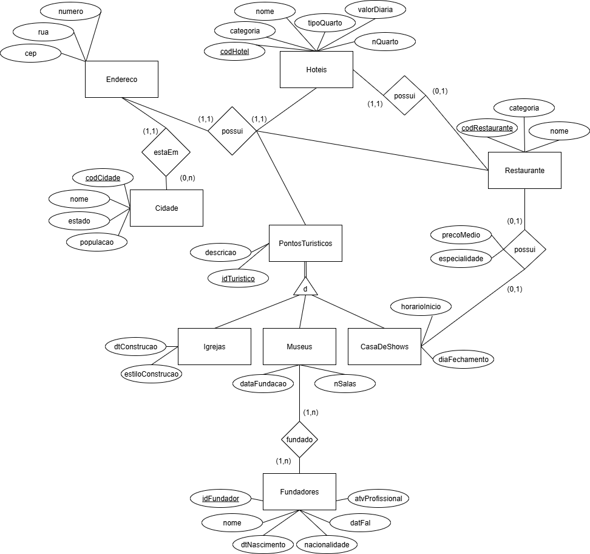

# BancoDeDados_Universidade_atividade 
## Atividade da matéria 'Laboratório de Banco de Dados' com fim de modelagem(diagrama EER), implementação no MySQL e consultas.
* **Faculdade:** UFMS
* **Curso:** Engenharia de Software
* **Ferramentas:**
  - draw.io;
  - phpMyAdmin / MySql ;
 
### Descrição:
 “A agência de turismo deve armazenar informações sobre recursos oferecidos pelas cidades que fazem parte da programação de turismo
 da agência. As informações a serem mantidas sobre cada cidade referem-se a hotéis, restaurantes e pontos turísticos: a) Hotéis: 
 guardar o código, o nome, o endereço, a categoria (estrelas), tipos de quartos (luxo, superluxo, ...), o número dos quartos e o
 valor da diária de acordo com o tipo do quarto; b) Cidade: armazenar nome, estado, população e código de identificação; c) Restaurante:
 possui um código que o identifica, nome, endereço, categoria (luxo, simples, ...). Um restaurante pode pertencer a um hotel e um hotel 
 somente pode ser associado a um restaurante; d) Pontos turísticos: igrejas, casas de show e museus. A agência somente trabalha com estes
 três tipos de pontos turísticos dos quais deve armazenar descrição e do endereço, além disso: d.1) igrejas devem possuir a data e o estilo
 de construção; d.2) Casas de show devem armazenar o horário de início do show (igual para todos os dias da semana) e o dia de fechamento 
 (apenas um dia na semana); d.3) Os museus tem data de fundação e número de salas. Um museu pode ter sido fundado por vários fundadores. 
 Para estes, armazenar o seu nome, data de nascimento e de falecimento (se houver), nacionalidade e atividade profissional que desenvolvia. 
 Um mesmo fundador pode ter fundado vários museus. Pontos turísticos recebem um código de identificação. O mesmo é válido para fundadores; 
 e) Uma casa de show pode possuir restaurante. Quando o cliente da agência reserva um passeio para uma casa de show, ele já sabe se esta 
 possui restaurante e qual o preço médio da refeição, além da especialidade  (comida chinesa, japonesa, brasileira, italiana, ...). Dentro
 de uma casa de show, apenas um restaurante pode existir.”
#### Implemente as consultas a seguir utilizando SELECT e nunca utilize múltiplas tabela na cláusula FROM, ao invés disso utilize JOIN.
- (a) Listar todas as cidades com população maior que 500.000.
- (b) Listar hotéis de luxo (categoria = ’5 estrelas’) em ordem alfabética pelo nome.
- (c) Listar todos os hotéis junto com o nome da cidade onde estão localizados.
- (d) Contar quantos hotéis existem em cada cidade.
- (e) Listar restaurantes que pertencem a hotéis de 4 ou 5 estrelas. Mostre o nome do
 restaurante, nome do hotel e a categoria.
- (f) Listar nome e endereço de casas de show que possuem restaurante.
- (g) Listar museus com o nome de seus fundadores.
- (h) Listar cidades que possuem mais de 3 pontos turísticos cadastrados.
- (i) Listar o tipo de quarto mais caro de cada hotel.
- (j) Listar casas de show que possuem restaurante e mostrar o preço médio da refeição.
- (k) Listar museus fundados há menos de 50 anos ordenados por data de fundação.
- (l) Calcular a idade do fundador na fundação do museu.
- (m) Listar o nome e data de fundação dos museus que fazem aniversário este mês"
 ### Modelagem:
 * #### **Modelo Conceitual**-EER
 <!--* ;-->

  

<!--
* #### **Modelo Lógico**
 <!--* ;-->
 <!--

  

<!--
* #### **Modelo Físico**
  - [Documento Script SQL](./universidade.sql)
 -->
⚠ **Atenção**: Material com fins de aprendizado, e assim sendo, pode conter **erros** e **insconsistências**.
<!--
* ### **Links e material de apoio** 📖
 - [Curso Banco de Dados - Metropole Digital]([./universidade.sql](https://materialpublic.imd.ufrn.br/curso/disciplina/3/73/8/6))
 - [Tipos de dados MySQL](https://pt.myservername.com/mysql-data-types-what-are-different-data-types-mysql#goog_rewarded)
 - **WELLING**, Luke; **THOMSON**, Laura. **PHP e MySQL: Desenvolvimento Web**. 5. ed. Rio de Janeiro: Campus/Elsevier, 2010.
-->
 
    

